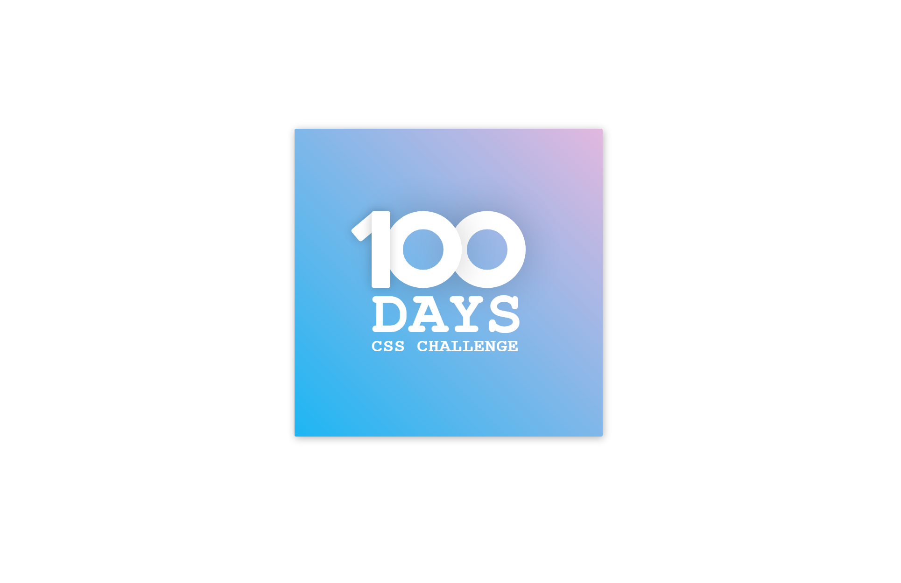

Day 1 of 100 Days of Coding with CSS

Today's was a simple box saying 100 days of css all aligned.

I was tempted to use bootstrap for this, but ended up going about this without a framework to get a better understanding of what can really be done using CSS only.

## Hi and Welcome 👋

The [100 Days of CSS Challenge](https://100dayscss.com/days/1/) was an interesting challenge to begin with and this is just the first of many to come.